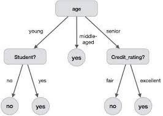

# Árvore de Decisão

## 1. Introdução

Árvore de decisão é um modelo de aprendizagem supervisionado, onde são dados
um conjunto de dados rotulados onde se tem uma variavel alvo predefinida para ser
a saida do sistema onde os dados rotulados são responsaveis por treinar o sistema
para se obter a saida. árvores de decisão são muito utilizadas em problemas de
classificação, podendo trabalhar com dados continuos ou categorias como forma de resultado
de seu processamento.
Para conseguir classificar determinada instância existente na árvore, ela é percorrida
de cima para baixo, onde em para se definir a que nó será visitado, depende do teste
que compõe cada relacionamento dos nós até que seja visitado um nó folha finalizando assim a
a busca pela classificação de instância.

## 2. Tipos de árvore de Decisão
* <b>Árvores de decisão categóricas</b>: árvores de decisão categoricas, são árvores que tem
por alvo uma variavel chamada de variável categórica: Exemplo um paciente vai ao medico
com febre e desconfia de estar com dengue, as possibilidades para esse paciente é que ele pode
estar com Dengue ou Não.

* <b>Árvores de decisão continuas</b>: árvores de decisão continuas, são árvores que tem por variavel alvo, uma variavel chamada de variavel continua (colocar exemplo)

## 3. Terminologia

<b>Nó raiz: </b> Representa toda polução ou amostra que pode ser divida em dois ou mais conjuntos.
<b>Separação:</b> É o processo responsavel por dividir um nó em dois ou mais sub-nós
<b>Nó de decisão:</b> É como é chamado a o nó proveniente da subdivisão de um outro nó
<b>Folha/Nó terminal:</b>É o nó terminal, o ultimo nó sem subdivisão
<b>Poda:</b> É a ação de retirar um nó da árvore
<b>Sub-árvore:</b> Uma sub-seção da árvore serja direita ou esquerda.

## 4. Justificava

A escolha do algoritmo se deu primeiramente pelo fato do problema ser de classificação e árvores de decisão são comumente utilizadas nesses tipos de abordagem. além de ter algumas das  seguintes vantagens:

* Árvores são simples de entender e serem interpretadas.
* Requerem pouca preparação dos dados.
* Capaz de trabalhar com dados numéricos e categóricos.
* Bom funcinamento na predição dos dados.

## 5. Métricas

Para avaliar a precisão da previsão de classicação dos dados pelo método da árvore de decisão foram utilizadas algumas métricas de avaliação do modelo. Para utilizar essas métricas, inicialmente foi necessário utilizar uma função da biblioteca "sklearn.model_metrics", que é:

* **train_test_split**: função que recebe o conjunto de dados que vão ser classificados e o conjunto alvo, ou seja, os resultados de classificação dos dados. O resultado é a separação em dados de treino e dados de teste, ambos divididos em dados para classificação e resultados da classicação desses dados.

Após a separação correta dos dados é realizado o treino do modelo com os dados de treino e a predição com conjunto de dados de teste. Com a predição realizada finalmente utiliza-se as métricas da biblioteca "sklearn.metrics", que são:

* **confusion_matrix**: métrica que recebe os dados previstos e retorna a classificação realizada em 4 grupos distintos: verdadeiro negativo(tn), que são dados classificados corretamente como negativos, falso positivo(fp), que são dados que foram classificados de forma incorreta em positivos, falso negativo(fn), que são dados que foram classificados de forma incorreta em negativos, e verdadeiro positivo(tp), dados que foram classificados corretamente em positivos.

* **accuracy_score**: métrica que recebe os dados previstos e as classificações corretas dos dados de teste, verificando a porcentagem de dados previstos corretamente em relação à classicação correta.

* **precision_score**: métrica que verifica a precisão de todos os dados que atestaram verdadeiro em relação aos dados que são falsos e foram classificados em verdadeiros. A fórmula utilizada é:

    **tp / (tp + fp)**

* **recall_score**: métrica que verifica a precisão de todos os dados que atestaram verdadeiro em relação aos dados totais que são verdadeiros. A fórmula utilizada é:

    **tp / (tp + fn)**

* **hamming loss**: métrica que verifica a porcentagem de dados que foram classificados de forma incorreta.

## 6. Referências

- skelearn. http://scikit-learn.org/stable/modules/tree.html acessado em 09/04/2018.
- skelearn. http://scikit-learn.org/stable/modules/generated/sklearn.model_selection.train_test_split.html
acessado em 16/04/2018.
- skelearn. http://scikit-learn.org/stable/modules/generated/sklearn.metrics.hamming_loss.html#sklearn.metrics.hamming_loss
acessado em 16/04/2018.
- skelearn. http://scikit-learn.org/stable/modules/generated/sklearn.metrics.confusion_matrix.html#sklearn.metrics.confusion_matrix
acessado em 16/04/2018.
- sklearn. http://scikit-learn.org/stable/modules/generated/sklearn.metrics.accuracy_score.html#sklearn.metrics.accuracy_score
acessado em 16/04/2018.
- sklearn. http://scikit-learn.org/stable/modules/generated/sklearn.metrics.precision_score.html#sklearn.metrics.precision_score
acessado em 16/04/2018.
- sklearn. http://scikit-learn.org/stable/modules/generated/sklearn.metrics.recall_score.html#sklearn.metrics.recall_score
acessado em 16/04/2018.
Anaytics Vdhaya.
- https://www.analyticsvidhya.com/blog/2016/04/complete-tutorial-tree-based-modeling-scratch-in-python/
acessado em 09/04/2018.
